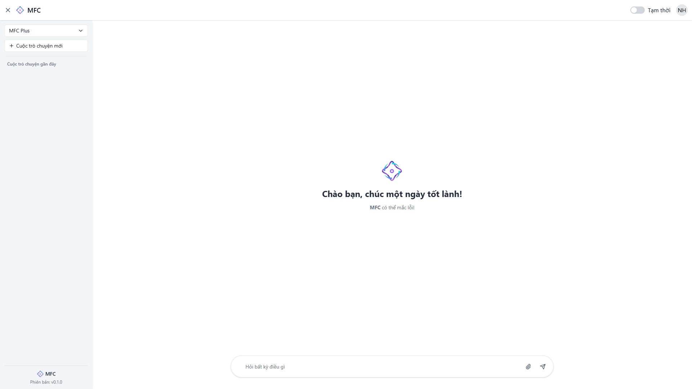

# MFC (Multi-Function Chat) - Tài liệu kỹ thuật

## 1. Giới thiệu tổng quan

MFC (Multi-Function Chat) là nền tảng trò chuyện đa chức năng được thiết kế để cung cấp trải nghiệm giao tiếp trực tuyến tiện lợi và hiệu quả, kết hợp các tính năng hiện đại hỗ trợ người dùng trong việc trò chuyện, chia sẻ thông tin và quản lý các cuộc hội thoại.

### Kiến trúc hệ thống

```
┌─────────────────┐      ┌───────────────────┐      ┌───────────────┐
│ Frontend Layer  │ ──▶ │ Backend Services  │ ──▶ │ Data Layer    │
│ (React/JS)      │ ◀── │ (C#/.NET API)     │ ◀── │ (Database)    │
└─────────────────┘      └───────────────────┘      └───────────────┘
        │                        │ ▲                       │
        │                        ▼ │                       │
        │                ┌───────────────────┐             │
        └───────────────│ AI Integration    │─────────────┘
                        │ Services          │
                        └───────────────────┘
                                │ ▲
                                ▼ │
                        ┌───────────────────┐      ┌───────────────┐
                        │ File Management   │ ──▶ │ Storage System │
                        │ & TTS Services    │ ◀── │ (Files/Audio)  │
                        └───────────────────┘      └───────────────┘
```

## 2. Các module chính

### Frontend Layer
- **Giao diện người dùng**: Xây dựng trên React.js, cung cấp trải nghiệm người dùng mượt mà và responsive
- **Chat UI**: Hiển thị tin nhắn theo thời gian thực, hỗ trợ cuộn và tự động cuộn xuống tin nhắn mới
- **Model Selection**: Cho phép người dùng chọn mô hình AI khác nhau cho trò chuyện
- **File Upload & Management**: Giao diện kéo thả và quản lý file

```jsx
// Ví dụ từ ChatContent.jsx
const scrollToBottom = () => {
  messagesEndRef.current?.scrollIntoView({ behavior: "smooth" })
}

useEffect(() => {
  scrollToBottom()
}, [messages, isLoadingBotResponse, isRenderingMessages])

// Ví dụ chức năng Text-to-Speech từ giao diện
const handleTextToSpeech = async (text, messageId) => {
  setIsLoadingTTS(prev => ({ ...prev, [messageId]: true }))
  try {
    const response = await fetch(`${API_URL_GENAI}/v2/ttsv2-gen`, {
      method: "POST",
      headers: {
        "Content-Type": "application/json",
      },
      body: JSON.stringify({
        text: text,
        voiceId: parseInt(voiceSettings.voice),
        speed: voiceSettings.speed,
        language: voiceSettings.language
      }),
    })
    // Xử lý phản hồi và phát âm thanh
  } catch (error) {
    // Xử lý lỗi
  }
}
```

### Backend Services
- **API RESTful**: Cung cấp các endpoint cho chat, quản lý người dùng, và tương tác với AI
- **Xác thực & Phân quyền**: JWT token, OAuth với Google, và quản lý phiên đăng nhập
- **Quản lý Context Chat**: Lưu trữ và quản lý ngữ cảnh của các cuộc trò chuyện

```csharp
// Ví dụ từ UserController.cs
[Authorize]
[HttpPost("api/user/change-title-chat")]
public async Task<IActionResult> ChangeTitleChat([FromBody] ChangeTitleChatDto data)
{
    // Logic thay đổi tiêu đề chat
}

// Xử lý xác thực JWT
public IActionResult VerifyToken()
{
    var token = Request.Headers["Authorization"].ToString().Split(" ")[1];
    var tokenHandler = new JwtSecurityTokenHandler();
    // Xác minh và xử lý token
}
```

### AI Integration Services
- **Text Generation**: Tích hợp với nhiều mô hình AI khác nhau
- **Conversation Context Management**: Duy trì ngữ cảnh cuộc trò chuyện để đảm bảo phản hồi liên quan
- **Auto-Naming**: Tự động đặt tên cho cuộc trò chuyện dựa trên nội dung

```javascript
// Ví dụ xử lý AI generation từ frontend
const response = await fetch(`${API_URL_GENAI}/v2/ai-gen`, {
    method: 'POST',
    headers: {
        'Content-Type': 'application/json'
    },
    body: JSON.stringify({
        prompt: message,
        model: modelValue,
        contextId: selectedChat
    })
});

// Ví dụ auto-naming cho chat mới
fetch(`${API_URL_GENAI}/v2/ai-gen`, {
    method: 'POST',
    headers: {
        'Content-Type': 'application/json'
    },
    body: JSON.stringify({
        prompt: `Giúp tôi đặt tên cho đoạn chat với tin nhắn đầu tiên là câu hỏi này: ${message}. Hãy chỉ đưa ra string tên chat và đừng nói gì thêm!`,
        model: modelValue
    })
})
```

### File Management & TTS Services
- **Upload & Storage**: Xử lý và lưu trữ file người dùng tải lên
- **Text-to-Speech**: Chuyển đổi văn bản thành giọng nói với nhiều tùy chọn
- **File Context for AI**: Sử dụng nội dung file để bổ sung ngữ cảnh cho AI

```javascript
// Ví dụ xử lý upload file
const handleFileUpload = async (e) => {
    const selectedFiles = Array.from(e.target.files || e.dataTransfer?.files || []);
    
    for (const file of selectedFiles) {
        const formData = new FormData();
        formData.append('upload', file);
        formData.append('contextId', selectedChat);

        try {
            const response = await fetch(`${API_URL_GENAI}/v2/upload-file`, {
                method: 'POST',
                body: formData
            });
            // Xử lý phản hồi
        } catch (error) {
            // Xử lý lỗi
        }
    }
}
```

### Data Layer
- **Database Schema**: Lưu trữ dữ liệu người dùng, tin nhắn, ngữ cảnh và file
- **Caching**: Tối ưu hóa hiệu suất thông qua caching
- **Transactions**: Đảm bảo tính nhất quán của dữ liệu

## 3. Luồng xử lý chính

### Trò chuyện với AI

1. **Khởi tạo/Chọn Chat**:
   - Người dùng tạo chat mới hoặc chọn chat hiện có
   - Frontend gọi API để lấy context ID, hoặc lấy lịch sử tin nhắn của chat đã chọn

2. **Gửi tin nhắn**:
   - Người dùng nhập và gửi tin nhắn
   - Frontend hiển thị tin nhắn và trạng thái loading
   - Request được gửi đến API với nội dung tin nhắn, context ID và model đã chọn
   - Backend xử lý request, gửi đến AI service
   - AI trả về phản hồi, được lưu vào database
   - Phản hồi được trả về client và hiển thị

3. **Tải lên file**:
   - Người dùng kéo thả hoặc chọn file
   - File được tải lên server thông qua API
   - Server lưu trữ file và cập nhật context với thông tin file
   - Frontend hiển thị danh sách file đã tải lên

4. **Text-to-Speech**:
   - Người dùng chọn tin nhắn và yêu cầu chuyển đổi thành giọng nói
   - Request được gửi đến API TTS với nội dung và cài đặt giọng nói
   - Server xử lý và tạo file audio
   - URL audio được trả về và phát cho người dùng

### Đăng nhập và Xác thực

1. **Đăng nhập**:
   - Người dùng nhập thông tin đăng nhập hoặc chọn đăng nhập bằng Google
   - Backend xác thực và tạo JWT token
   - Token được lưu ở client và sử dụng cho các request tiếp theo

2. **Xác thực API**:
   - Mỗi request API đều kèm theo JWT token trong header
   - Backend middleware xác thực token trước khi xử lý request
   - Nếu token không hợp lệ, trả về lỗi 401 Unauthorized

## 4. Tính năng chính và công nghệ

### Tính năng chính

- **Trò chuyện thời gian thực**: Giao diện chat mượt mà với phản hồi tức thì
- **Hỗ trợ nhiều mô hình AI**: Người dùng có thể chọn mô hình AI khác nhau
- **Quản lý ngữ cảnh chat**: Tạo, lưu trữ và chuyển đổi giữa các cuộc trò chuyện
- **Tải lên và phân tích file**: Hỗ trợ tải lên file và sử dụng nội dung trong trò chuyện
- **Text-to-Speech**: Chuyển đổi phản hồi AI thành giọng nói với nhiều tùy chọn
- **Đăng nhập an toàn**: Hỗ trợ đăng nhập thông thường và OAuth với Google
- **Responsive Design**: Trải nghiệm liền mạch trên mọi thiết bị

### Công nghệ sử dụng

- **Frontend**: React.js, CSS, HTML5, JavaScript
- **Backend**: .NET Core, C#, RESTful API
- **Database**: SQL Server/MySQL với Entity Framework
- **Authentication**: JWT, OAuth 2.0
- **AI Integration**: Tích hợp với các API mô hình AI tiên tiến
- **Cloud Storage**: Lưu trữ an toàn cho file và âm thanh
- **DevOps**: CI/CD pipeline, containerization

## 5. Hiệu năng và bảo mật

### Hiệu năng
- **Tối ưu hóa render**: Sử dụng React memo và useCallback để giảm render không cần thiết
- **Lazy loading**: Tải các component và dữ liệu khi cần thiết
- **API Caching**: Giảm số lượng request bằng caching hợp lý
- **Tối ưu hóa truy vấn database**: Indexes và truy vấn hiệu quả

### Bảo mật
- **Xác thực mạnh**: JWT với thời gian hết hạn ngắn
- **HTTPS**: Mã hóa dữ liệu truyền tải
- **Input Validation**: Kiểm tra và làm sạch đầu vào trên cả client và server
- **File Validation**: Kiểm tra loại và kích thước file trước khi tải lên
- **Role-based Access Control**: Phân quyền người dùng

## 6. Hình ảnh minh họa




## 7. Liên hệ và hỗ trợ

Nếu bạn có bất kỳ câu hỏi hoặc cần hỗ trợ, vui lòng liên hệ với chúng tôi qua email hoặc truy cập trang web của chúng tôi để biết thêm thông tin.

- **Email**: nguyenhuutai.reseter@gmail.com
- **Website**: [huutai-dev.hackquest.com](https://huutai-dev.hackquest.com)
- **GitHub**: [github.com/reseter1/MultiFunctionChatApp](https://github.com/reseter1/MultiFunctionChatApp)

---

Tài liệu này mô tả chi tiết về MFC (Multi-Function Chat), một nền tảng trò chuyện đa chức năng với tích hợp AI, quản lý file và Text-to-Speech. Dự án kết hợp frontend React.js với backend .NET để tạo ra trải nghiệm người dùng liền mạch và đáp ứng các nhu cầu giao tiếp hiện đại.